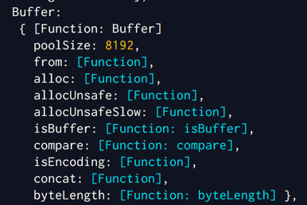

> _But `this` is preposterous!<br/>Yes, it is._

#### What is `this`?

`this` is a reference to some object. What does that mean? It means that `this` is not something that has an intrinsic value.

Consider
```javascript
let a=5;
```

`a=5` in the above example tells us that `a` has a value of `5`. Unlike `a`, `this` doesn't have a value of its own. Instead, it is simply a reference to some other object in memory.

#### The global object

The best way to understand `this` is to simply try a few things out. Open a node repl and simply type in `this` and press enter. What do you get? You should get a screenful of strange things. These strange things are key value pairs, much like any other object. You might get something like this



_Note: Colours might be different/absent based on your settings_

The above screenshot represents what is called the global object. When you typed `this` into your node repl, it referred to this global object which currently holds all the context. What context, you might ask?

Let us see.

Try this:
```javascript
this.hero="goldie";
this.villain="silvery";

console.log(this.hero,"is greater than",this.villain);
```

produces

```javascript
goldie is greater than silvery
```

Two things to note here.

1. When you typed in `this.hero="goldie"`, it didn't complain about `this` not being defined. Which means, `this` was already defined.
1. If `this` didn't hold special meaning, you would think that this was just any other object.

Now let us try this:
```javascript
console.log(hero,"is greater than",villain);
```

produces

```javascript
goldie is greater than silvery
```

What sorcery is this?! We defined `this.hero` and `this.villain`. How did `hero` and `villain` get defined. After all, we put attributes into some object called `this`. How do `hero` and `villain` automatically get defined?

We need to understand that there is a global object that node uses. This global object is referenced by `this`. Whenever we assign something to a variable, the variable gets defined within the global object.

Let us try it the other way around

```javascript
sidekick="bronzy";
console.log(this.sidekick,"is also better than the villain");
```

produces

```javascript
bronzy is also better than the villain
```

This means, that the association is both ways. When we define something on `this` it becomes globally available and when we define something globally, it becomes an attribute in the global object.

#### What else is in the global object?

The global object contains references to several things apart from variables that we define globally. We have all used `console.log`. If you look at `console.log` and didn't know that `console` was something special in Javascript, you would think that `console` is an object.

In fact, `console` is an object. Given that we never defined it, then it is likely that `console` is defined in the global object. Let us see.

```javascript
this.console
```
gives us

```javascript
Console {
  log: [Function: bound log],
  info: [Function: bound log],
  warn: [Function: bound warn],
  error: [Function: bound warn],
  dir: [Function: bound dir],
  time: [Function: bound time],
  timeEnd: [Function: bound timeEnd],
  trace: [Function: bound trace],
  assert: [Function: bound assert],
  Console: [Function: Console] }
```

Further, when we do the following, see what happens:

```javascript
this.console.log("Hello world");
```

produces

```javascript
Hello World
```

Not only is there a reference named `this.console.log`, but it works just like `console.log`. It works that way because it *is* the same.

#### Calling context
